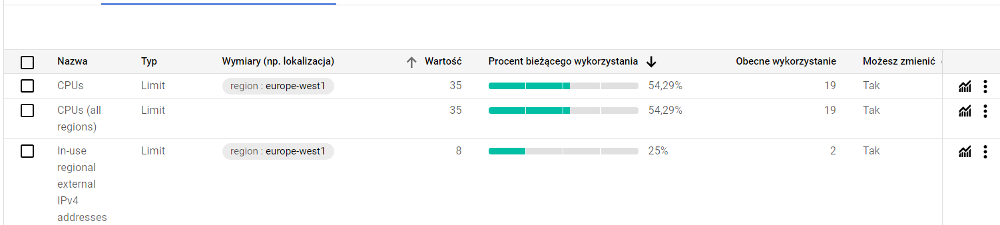
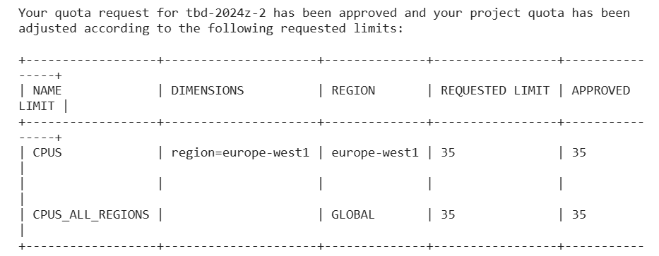
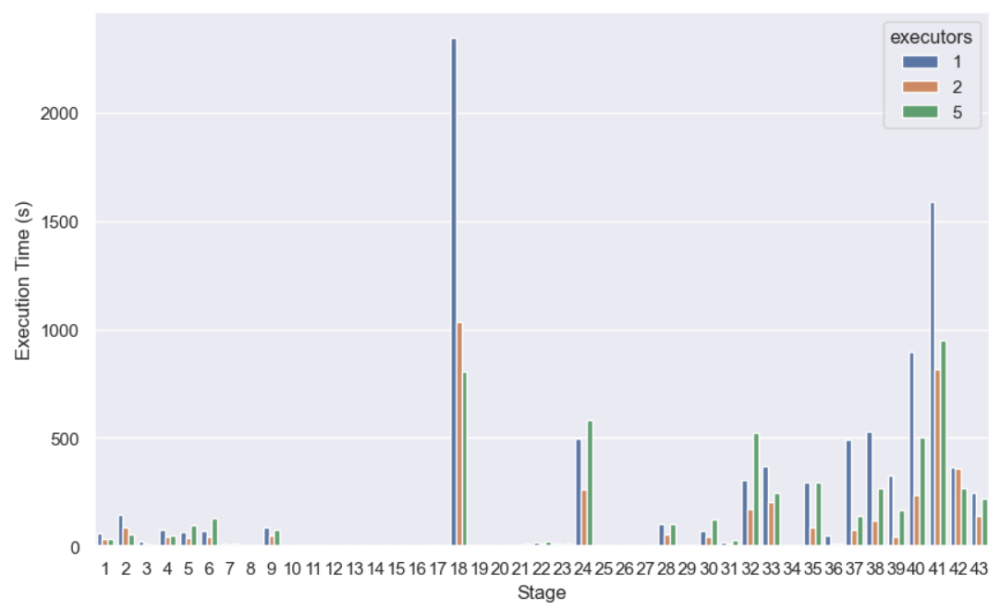

0. The goal of phase 2b is to perform benchmarking/scalability tests of sample three-tier lakehouse solution.

Celem drugiej części ćwiczenia było dokonanie testów wydajnościowych/skalowalności.

1. In main.tf, change machine_type at:

```
module "dataproc" {
  depends_on   = [module.vpc]
  source       = "github.com/bdg-tbd/tbd-workshop-1.git?ref=v1.0.36/modules/dataproc"
  project_name = var.project_name
  region       = var.region
  subnet       = module.vpc.subnets[local.notebook_subnet_id].id
  machine_type = "e2-standard-2"
}
```

and subsititute "e2-standard-2" with "e2-standard-4".

 Podmieniono machine_type = "e2-standard-2"na machine_type = "e2-standard-4".

 ```
  module "dataproc" {
    depends_on   = [module.vpc]
    source       = "github.com/bdg-tbd/tbd-workshop-1.git?ref=v1.0.36/modules/dataproc"
    project_name = var.project_name
    region       = var.region
    subnet       = module.vpc.subnets[local.notebook_subnet_id].id
    machine_type = "e2-standard-4"
  }
 ```

2. If needed request to increase cpu quotas (e.g. to 30 CPUs): 
https://console.cloud.google.com/apis/api/compute.googleapis.com/quotas?project=tbd-2023z-9918

Poproszono o zwiększenie dostępnych CPU do 35.



Otrzymano również na maila potwierdzenie, że pomyślnie udało się uzyskać zgodę na zwięk
szenie limitu dostępnych CPU dla regionu europe-west1.



3. Using tbd-tpc-di notebook perform dbt run with different number of executors, i.e., 1, 2, and 5, by changing:
```
 "spark.executor.instances": "2"
```

in profiles.yml.

Przy użyciu notatnika tbd-tpc-di uruchomiono przebieg dbt z liczbą egzekutorów 1, 2 i 5.

4. In the notebook, collect console output from dbt run, then parse it and retrieve total execution time and execution times of processing each model. Save the results from each number of executors. 

Fragment wyniku dla 1 executora:
```
 17:18:41 43 of 43 START sql table model demo_gold.fact_cash_balances .................... [RUN]
 25/01/19 17:18:41 WARN ResolveSessionCatalog: A Hive serde table will be created as there is no table provider specified. You can set spark.sql.legacy.createHiveTableByDefault to false so that native data source table will be created instead.
 17:22:48 43 of 43 OK created sql table model demo_gold.fact_cash_balances ............... [OK in 247.38s]
 17:22:48
 17:22:48 Finished running 43 table models in 2 hours 32 minutes and 50.89 seconds (9170.89s).
 17:22:48
 17:22:48 Completed successfully
 17:22:48
 17:22:48 Done. PASS=43 WARN=0 ERROR=0 SKIP=0 TOTAL=43
```
Fragment wyniku dla 2 executorów:
```
 14:22:01 43 of 43 START sql table model demo_gold.fact_cash_balances .................... [RUN]
 25/01/19 14:22:02 WARN ResolveSessionCatalog: A Hive serde table will be created as there is no table provider specified. You can set spark.sql.legacy.createHiveTableByDefault to false so that native data source table will be created instead.
 14:24:19 43 of 43 OK created sql table model demo_gold.fact_cash_balances ............... [OK in 137.63s]
 14:24:19
 14:24:19 Finished running 43 table models in 1 hours 8 minutes and 7.53 seconds (4087.53s).
 14:24:19
 14:24:19 Completed successfully
 14:24:19
 14:24:19 Done. PASS=43 WARN=0 ERROR=0 SKIP=0 TOTAL=43
```

 Fragment wyniku dla 5 executorów:
```
 19:03:26 43 of 43 START sql table model demo_gold.fact_cash_balances .................... [RUN]
 25/01/19 19:03:27 WARN ResolveSessionCatalog: A Hive serde table will be created as there is no table provider specified. You can set spark.sql.legacy.createHiveTableByDefault to false so that native data source table will be created instead.
 19:07:07 43 of 43 OK created sql table model demo_gold.fact_cash_balances ............... [OK in 220.82s]
 19:07:07
 19:07:07 Finished running 43 table models in 1 hours 37 minutes and 26.83 seconds (5846.83s).
 19:07:07
 19:07:07 Completed successfully
 19:07:07
 19:07:07 Done. PASS=43 WARN=0 ERROR=0 SKIP=0 TOTAL=43
```

5. Analyze the performance and scalability of execution times of each model. Visualize and discucss the final results.

 Na podstawie uzyskanych wyników można stwierdzić, że zwiększanie liczby executorów skraca
 wymagany czas do realizacji kroków uruchomionego dbt, aczkolwiek przesadzenie z ich liczbą
 może wywoływać efekt odwrotny, czyli wydłużać całkowity czas obliczeń. Porównanie czasu
 wykonywania kolejnych kroków dla różnej liczby executorów przedstawia zbiorczy wykres po
niżej:


   
Spośród testowanych wartości [1, 2 i 5] dla instancji executora sparka, wartość 2 wydaje
 się być optymalna. W naszym przypadku, dla wartości "1", zadanie wykonywało się około 2
 godziny i 32 minuty, z kolei dla wartości "2"czas skrócił się o ponad połowę do 1 godziny i 8
 minut. Zwiększenie liczby executorów z 2 do 5, spowodowało jednak to, że czas wykonywania
 wydłużył się o około 40% do 1 godziny i 37 minut. Można zatem reasumować, że zarówno
 zbyt mała, ale też i zbyt duża liczba instancji executora nie pozwala na efektywne delegowanie
 zadań, co dla pierwszego przypadku skutkuje przytłoczeniem wielkością pracy do wykonania a
 dla przypadku drugiego skutkuje wyścigiem i konkurowaniem o dostępne zasoby.